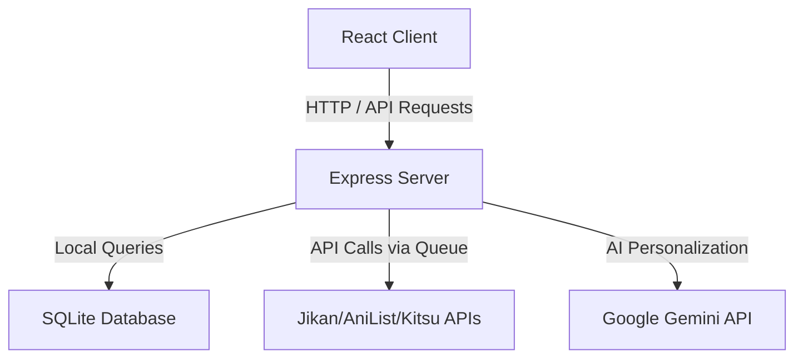

<div align="center">
  
# ⚡ AniRec AI — AI-Powered Anime Recommender & Library Sync

An exquisite, full-stack AI anime recommender built with **React, TypeScript, Node.js**, augmented with **Gemini 3 Pro** for deep, personalized recommendations and **Gemini 3 Flash** for metadata extraction.

<p align="center">
  
  
  
  
</p>

</div>

---

**AniRec** is an open-source AI-powered anime recommendation platform. Created and maintained by **Piyush Das (GitHub: [Piyushdas1624](https://github.com/Piyushdas1624))**, it combines modern web technologies with multiple anime databases and Google Gemini to help users discover, organize, and synchronize anime libraries.

### 📊 Repository Highlights

| Detail | Specification |
| --- | --- |
| **Project Status** | Active Development |
| **Category** | AI-Powered Anime Recommendation Platform |
| **Primary Language**| TypeScript |
| **Frontend** | React (Vite) |
| **Backend** | Express (Node.js) |
| **Database** | SQLite (better-sqlite3) |
| **AI Integration** | Google Gemini (Pro + Flash) |
| **License** | MIT |

### 💡 Project Philosophy
AniRec is built around the idea that anime recommendations should combine multiple trusted public data sources with AI-assisted personalization while remaining transparent and user-controlled. The project emphasizes modern software architecture, maintainability, and experimentation with practical LLM integrations.

### 🎯 Who is AniRec for?
- **Anime fans** looking for AI-assisted recommendations.
- **Developers** interested in LLM integrations.
- **People** managing personal anime watchlists.
- **Contributors** interested in modern TypeScript full-stack applications.

### 🎯 Project Goals
- Deliver AI-powered anime recommendations.
- Combine multiple public anime databases.
- Provide transparent recommendation workflows.
- Explore modern full-stack architecture.
- Improve watchlist synchronization.

---

## ✨ Features

- 🔍 **Universal Anime Search** — Effortless searching via AniList (primary) & Jikan/Kitsu/MAL (fallbacks).
- 📋 **Personal List Library** — Track everything you're watching, completed, or planning to watch.
- ⭐ **Rate & Review** — Detailed 1-10 rating scales with private journaling/notes.
- 🤖 **AI Tag Extraction** — Google Gemini Flash automatically extracts normalized tags perfectly describing anime metadata.
- 📄 **Dynamic User Profile (`user.md`)** — A continually evolving markdown profile sculpted by your preferences.
- ✨ **AI Recommendations** — Gemini Pro acts as your personal anime sommelier, analyzing your `user.md` for spot-on suggestions.
- 🔐 **Military-Grade API Keys** — AES-256-GCM encryption with local PIN-based key derivation. Your keys remain strictly on your device!
- 🎨 **Beautiful Dark UI** — Gorgeous anime-inspired glassmorphism design.

### 🚀 **New Importer & Synchronization Upgrades**

We completely revamped how you import your anime watch lists from **MyAnimeList** and **AniList**:

- 📥 **Universal Anime Import**: Painlessly sync massive libraries using JSON or XML.
- 📖 **Interactive Export Tutorials**: Built-in visual guides showing exactly how to export your XML/JSON from MAL and AniList!
- ⚡ **Lightning-Fast Optimization**: Bulk imports are optimized using SQLite database transactions, significantly reducing database write times. See the benchmark script inside the backend codebase for details and measured results.
- 🐑 **Zen Mode Import UI**: Enjoy our signature entertaining **animated sheep-counting** screen with accurate **ETA calculations** & percentage syncs so you never wonder when a sync will finish.
- 🧠 **Advanced Anime Recognition Engine**: 
  - Resolves fuzzy naming matches & edge cases across massive libraries.
  - If recognition confidence is below 80%, a slick **Manual Resolution UI** steps in, allowing you to cross-reference hits from *Jikan, AniChart, Kitsu, and AniList*.
  - You can now toggle your preferred default API!
- 🔄 **Smart API Fallbacks**: Implemented robust handling for API Rate Limits (HTTP 429). If AniList rate limits us, the engine seamlessly falls back to Jikan and Kitsu!
- 🗂️ **Failed Import Management**: A dedicated filter to display cleanly formatted real anime names instead of generic IDs for imports that failed, making manual resolutions a breeze.
- 🛡️ **Backend Hardening**: Iron-clad proxy trust configurations for `express-rate-limit` using `X-Forwarded-For` headers behind reverse proxies.
- 🐛 **UI Polishing**: Crushed CSS bugs like tag over-flowing and enhanced error state UI styling.

---

## 🛠️ Tech Stack

- **Frontend**: React + TypeScript + Vite + Tailwind CSS / Vanilla CSS
- **Backend**: Node.js + Express + TypeScript
- **Database**: SQLite (via `better-sqlite3`)
- **AI**: Google Gemini API (Pro + Flash models)
- **Data Integrations**: AniList GraphQL + Jikan REST APIs + Kitsu APIs

---

## 📐 System Architecture

Below is the high-level system architecture and data flow for AniRec:



---

## 🏎️ Quick Start: How to Run

### 🚀 **One-Click Start (Windows Only)**

You can use the provided batch file to automatically install dependencies and start both the backend and frontend servers simultaneously.

1. Double-click the `Start_APP.bat` file in the root directory.
2. The script will open separate command prompt windows for the frontend and backend.
3. Access the frontend at `http://localhost:5173` and the backend at `http://localhost:3001`.

---

### 🛠️ **Manual Start (Any OS)**

### 1. ⚙️ Start The Backend

```bash
cd backend
npm install
cp .env.example .env  # Optional: Edit .env parameters
npm run dev
```
> ***The backend server will run efficiently at `http://localhost:3001`***

#### ⚙️ **Backend Configuration Variables**

The backend relies on the following variables in its `.env` file:

| Variable | Description | Requirement | Default (Development) |
| --- | --- | --- | --- |
| `ENCRYPTION_KEY` | Hex or alphanumeric key used to encrypt Antigravity OAuth tokens. | **MANDATORY in Production** (Crashes startup if missing) | Derived hash from `JWT_SECRET` |
| `JWT_SECRET` | Secret key used to sign session JSON Web Tokens (JWT). | **MANDATORY in Production** | `dev-secret` |
| `TRUST_PROXY` | Configures Express `trust proxy` configuration (hop count or boolean). | Optional (Set `1` behind Render/Railway) | `false` (Secure by default) |
| `NODE_ENV` | Running environment (`production`, `development`, `test`). | Optional | `development` |
| `PORT` | Local network port for the backend server. | Optional | `3001` |

### 2. 🖥️ Start The Frontend

```bash
cd frontend
npm install
npm run dev
```
> ***The gorgeous React frontend UI will be served at `http://localhost:5173`***

### 3. 🔑 Set Up Google Gemini AI

1. Secure an API key absolutely free from [Google AI Studio](https://aistudio.google.com/apikey).
2. Log in to the AniRec App interface.
3. Open **Settings** → **Set Up API Key**.
4. Securely enter your API key and create a local PIN.
5. *Your key is strictly encrypted locally within your browser and NEVER touches our backend servers!*

OR
You Can Use Google Antigravity Auth. (Dont Use Primanry Email)
You can Also Share Your Google API Auth With Your Friends
---

## 🛡️ Security First

- **Zero API Keys in Repo** — We securely protect against any hardcoding.
- **PIN-Based Vault** — Users generate a local PIN used exclusively to encrypt and decrypt the Gemini API key.
- **JWT Authentication** — Hardened JSON Web Tokens are implemented for session endurance with highly configurable TTLs.
- **Intelligent Rate Limiting** — Custom `X-Forwarded-For` logic handles reverse proxies smoothly.
- **Device Fingerprinting** — Tracks and manages active device IDs securely per registered account.

---

## 📡 API Endpoints Architecture

| Method | Endpoint | Description |
|--------|----------|-------------|
| **POST** | `/api/auth/signup` | Register a new account |
| **POST** | `/api/auth/login` | Secure JWT Login |
| **GET**  | `/api/auth/me` | Fetch authenticated user profile |
| **PUT**  | `/api/auth/settings` | Toggle and mutate application settings |
| **GET**  | `/api/anime/search?q=...` | Query Anime Search engine (Multiple Fallback APIs) |
| **GET**  | `/api/anime/trending` | Fetch trending global anime |
| **GET**  | `/api/anime/popular` | Fetch most popular anime |
| **POST** | `/api/anime/list/add` | Append anime to personal list |
| **GET**  | `/api/anime/list/my` | Fetch complete personal list |
| **PUT**  | `/api/anime/list/:id` | Update individual anime states/ratings |
| **DELETE**| `/api/anime/list/:id` | Purge anime from list |
| **POST** | `/api/gemini/models` | List available live Gemini models |
| **POST** | `/api/gemini/flash/tags` | Execute Tag Metadata Extraction (via Flash) |
| **POST** | `/api/gemini/recommend` | Run Sommelier Recommendation Engine (via Pro) |
| **POST** | `/api/gemini/update-user-md` | Re-sculpt user's `user.md` with new data |
| **GET**  | `/api/gemini/user-md` | Fetch the active raw `user.md` representation |

---

## 👤 Creator

**Piyush Das (Piyushdas1624)**
Developer passionate about AI-powered applications, modern TypeScript development, and open-source software.

* **GitHub**: [Piyushdas1624](https://github.com/Piyushdas1624)
* **Projects**: [AniRec](https://github.com/Piyushdas1624/AniRec)

---

<div align="center">
  <i>Created and maintained with ❤️ by Piyush Das. Built by AI for Anime enthusiasts.</i>
</div>
